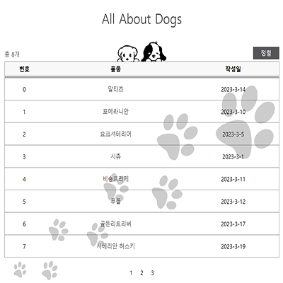

# NextJS Project

## 💡 프로젝트 소개 
  여러 강아지의 대한 내용을 NextJS를 사용하여 블로그 형식으로 만든 페이지입니다. 
  사용자는 제목을 클릭하여 내용으 자세히 볼 수 있고,
  Home으로 돌아가기 버튼을 클릭하여 리스트로 돌아올 수 있습니다. 

## 💡 사용 스택
  - CSS3
  - JavaScript
  - NextJS

## 💡 기능 설명
    - 게시글 좌측 상단에 한 페이지당 보이는 게시글의 개수를 보여줍니다.

    - 품종을 선택하면 상세 페이지로 이동합니다.

    - 상세 페이지에서 HOME 버튼을 클릭하면 다시 HOME으로 돌아옵니다.

    - 정렬 버튼을 클릭하여 게시글을 새롭게 정렬할 수 있습니다.

    - pagination이 적용돼있어 하단에 페이지 버튼을 클릭하면 다음 페이지로 이동합니다.

## 💡 프로젝트를 통해 배운점
  

  SSR(Server Side Rendering)에 대해 공부해보는 계기가 되었다.  
  확실히 랜더링 준비를 마친 데이터를 받아 브라우저에 띄우니 처음 화면이 보이는 속도가 빠르다고 느꼈다.
  

  
